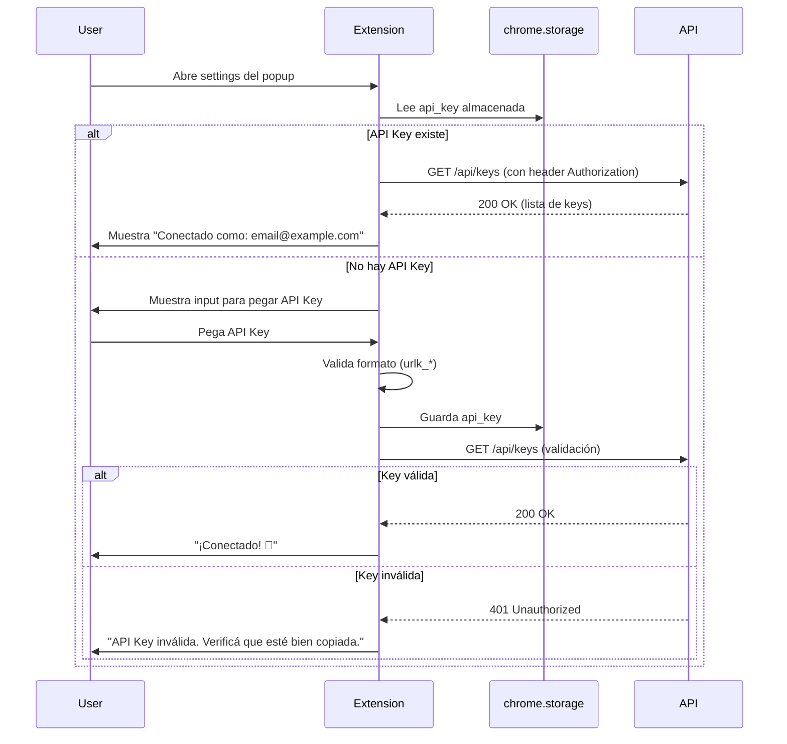
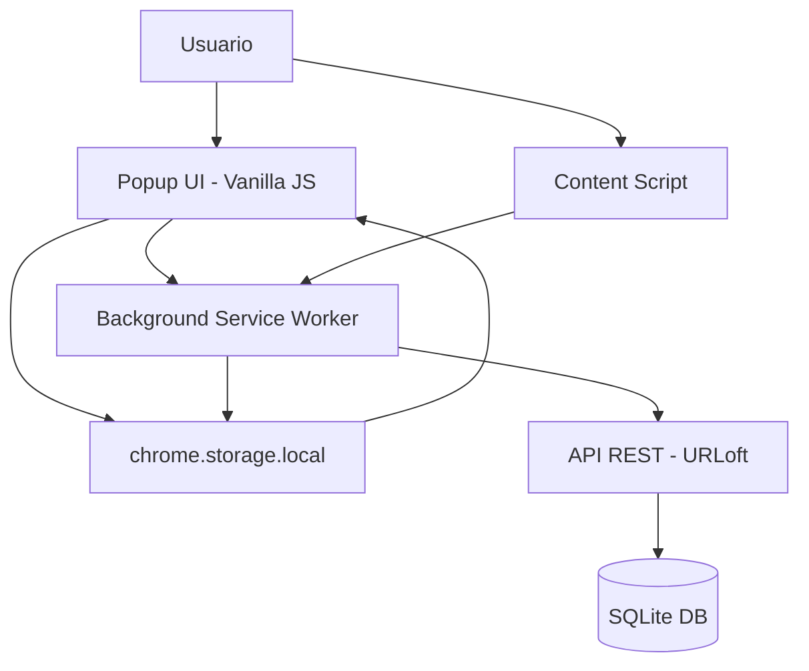
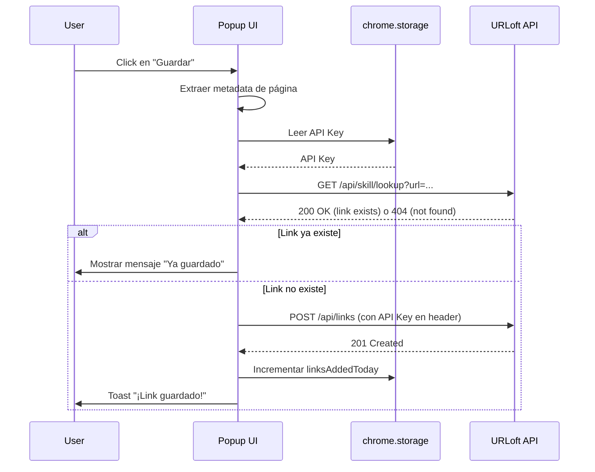
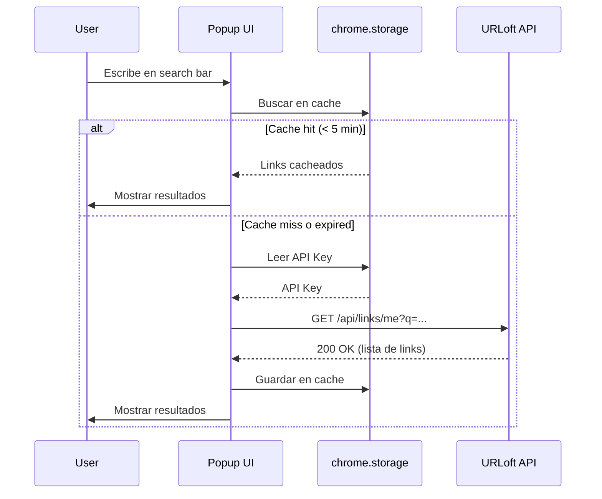

# 🔌 URLoft - Chrome Extension Specification

> **Especificación técnica completa para la extensión de Chrome de URLoft.**
>
> Este documento define el alcance, arquitectura, flujos de usuario y detalles de implementación de la extensión de Chrome.

---

## 📋 Table of Contents

1. [Overview](#1-overview)
2. [Autenticación](#2-autenticación)
3. [Core Features MVP](#3-core-features-mvp)
4. [Smart Features](#4-smart-features)
5. [Arquitectura Técnica](#5-arquitectura-técnica)
6. [Flujo de Datos](#6-flujo-de-datos)
7. [Security Considerations](#7-security-considerations)
8. [MVP Timeline](#8-mvp-timeline)
9. [Preguntas Abiertas](#9-preguntas-abiertas)

---

## 1. Overview

### 1.1 Objetivo

La extensión de Chrome de URLoft permite a los usuarios guardar links rápidamente mientras navegan, sin tener que ir al sitio web. Se integra en el flujo natural de navegación y proporciona acceso instantáneo a la biblioteca personal de links.

### 1.2 Alcance MVP vs Futuro

#### MVP (Sprint 1-3)
- ✅ Autenticación con API Key
- ✅ Guardar página actual
- ✅ Buscar links personales
- ✅ Gestión de categorías
- ✅ Detección de links duplicados
- ✅ Indicador visual (badge)

#### Futuro (Post-Hackathon)
- 📌 Detectar links en la página actual
- 📌 Modo sidebar/panel
- 📌 Sincronización offline
- 📌 Notificaciones de actualización
- 📌 Quick capture (shortcut de teclado)
- 📌 Integración con servicios de terceros (Pocket, Raindrop, etc.)

### 1.3 Stack Técnico

La decisión tomada para el desarrollo de la extensión es utilizar **Vanilla JS + HTML puro**. Esta elección prioriza la velocidad de ejecución y la simplicidad extrema para el hackathon.

| Componente | Tecnología | Justificación |
|------------|-----------|---------------|
| **Manifest** | V3 | Única versión soportada por Chrome (MV2 está deprecated) |
| **Popup UI** | **Vanilla JS + HTML** | CERO dependencias, CERO build step, máxima compatibilidad |
| **Build Tool** | **Ninguno** | Solo archivos estáticos, desarrollo y recarga instantánea |
| **Storage** | chrome.storage.local | Persistencia de credenciales y caché de links |
| **Background** | Service Worker | Requerido por MV3 para interceptar eventos y manejar auth |
| **Content Scripts** | Vanilla JS | Extracción de metadata sin dependencias externas |
| **Icons** | SVG → PNG | Iconos optimizados para la barra de herramientas |

**Justificación de la decisión:**

1. **Speed > Todo**: Es un hackathon, necesitamos ALGO QUE FUNCIONE YA. Sin configuración de bundlers, sin transpilación, sin dramas de dependencias.

2. **CERO Build Step**: Editar un archivo `.js` o `.html` y recargar la extensión en Chrome es instantáneo. Esto acelera el ciclo de feedback al máximo.

3. **Performance Nativa**: El popup se carga en menos de 10ms. Sin el overhead de un framework, la experiencia de usuario es fluida desde el primer frame.

4. **Simplicidad y Robustez**: Al no usar abstracciones, tenemos control total sobre las APIs de Chrome (tabs, storage, messaging). Evitamos problemas de compatibilidad con CSP (Content Security Policy) o Shadow DOM que a veces surgen con frameworks.

**Trade-off aceptado:**
Aceptamos escribir más código boilerplate (manejo manual del DOM) a cambio de eliminar la complejidad accidental de las herramientas de build y las actualizaciones de estado complejas. Para el alcance de esta extensión, Vanilla JS es la herramienta más eficiente.

---

## 1.4 Filosofía de Diseño

### Puntos Fuertes: Buscar + Agregar

La extensión de URLoft tiene **DOS puntos fuertes** que la diferencian:

1. **AGREGAR** (Guardar desde cualquier página)
   - Extracción automática de metadata (URL, título, descripción)
   - Detección de duplicados instantánea
   - Asignación de categorías al vuelo
   - Feedback visual inmediato (toast, badge)

2. **BUSCAR** (Encontrar lo que guardaste)
   - Búsqueda full-text instantánea
   - Filtros por categoría, sort, likes, views
   - Acceso a links sin abrir el sitio web
   - Paginación infinita

### Todo lo demás es secundario

- Detectar links en la página → Post-MVP
- Modo sidebar → Post-MVP
- Offline mode → Post-MVP
- Quick capture (shortcuts) → Post-MVP

### Principio de simplicidad

> "Perfecto es cuando no hay nada más que sacar." — Antoine de Saint-Exupéry

Cada feature debe pasar esta prueba:
- ¿Es esencial para AGREGAR o BUSCAR?
- ¿No se puede hacer de otra forma más simple?
- ¿El valor justifica la complejidad?

Si la respuesta es NO a cualquiera → Post-MVP.

---

## 2. Autenticación

La extensión utiliza **API Key** como único método de autenticación. Esta decisión simplifica radicalmente la integración y el mantenimiento.

### 2.1 Método: API Key

**Descripción:**
El usuario genera una API Key desde el dashboard (`/dashboard/keys`) y la pega en la configuración de la extensión. La API Key se envía en el header `Authorization: Bearer <key>` en cada request.

**Justificación de la elección:**

1. **Simplicidad Técnica**: Es un hackathon. Las sesiones con cookies en extensiones son complejas de manejar (CORS, SameSite, sincronización entre background y popup). Un string en el header funciona siempre y en cualquier contexto.

2. **Consistencia con el Ecosistema**: URLoft ya implementó API Keys para el MCP Server y la Web Skill. Usar el mismo mecanismo en la extensión mantiene el backend coherente y simplificado.

3. **Menos Bugs de CORS/Auth**: Evitamos problemas comunes de las cookies que expiran o son bloqueadas por políticas del navegador. Una API Key es persistente hasta que el usuario decida revocarla.

4. **Facilidad de Desarrollo**: Podemos probar la extensión simplemente pegando una key válida, sin necesidad de implementar flujos de login/password complejos dentro del popup.

### 2.2 Flujo de Autenticación (API Key)




### 2.5 Almacenamiento Seguro de Credenciales

**Ubicación:** `chrome.storage.local`

**Estructura:**
```typescript
interface ExtensionStorage {
  apiKey: string;           // Ej: "urlk_a1b2c3d4e5f6g7h8"
  userId: number;           // Cache del ID de usuario
  userEmail: string;        // Cache del email (para mostrar en UI)
  lastValidated: string;    // ISO timestamp de la última validación exitosa
  linksCache: Link[];       // Cache de links recientes (opcional)
  categoriesCache: Category[]; // Cache de categorías (opcional)
}
```

**Validación de formato:**
Las API keys tienen el prefijo `urlk_` seguido de 32 caracteres hexadecimales (ej: `urlk_a1b2c3d4e5f6g7h8i9j0k1l2m3n4o5p6`).

**Función de validación:**
```typescript
function isValidApiKeyFormat(key: string): boolean {
  return /^urlk_[a-f0-9]{32}$/.test(key);
}
```

**Timeout de validación:**
Cada vez que se hace una request a la API, si responde con 401, se borra la API key del storage y se fuerza re-login.

---

## 3. Core Features MVP

> **Puntos fuertes de la extensión: Buscar + Agregar**

### 3.1 Buscar Mis Links (Prioridad #1)

**Endpoint:** `GET /api/links/me`

**Query Parameters:**
```typescript
interface GetLinksMeQuery {
  q?: string;              // Búsqueda full-text (título, descripción, URL)
  sort?: 'recent' | 'likes' | 'views' | 'favorites';
  categoryId?: number;     // Filtrar por categoría
  page?: number;           // Default: 1
  limit?: number;          // Default: 20, Max: 100
}
```

**Payload Response (200 OK):**
```typescript
interface GetLinksMeResponse {
  data: {
    links: {
      id: number;
      url: string;
      title: string;
      description: string | null;
      shortCode: string;
      isPublic: boolean;
      category: {
        id: number;
        name: string;
        color: string;
      } | null;
      stats: {
        views: number;
        likes: number;
        favorites: number;
      };
      createdAt: string;
    }[];
    pagination: {
      page: number;
      limit: number;
      total: number;
      totalPages: number;
    };
  };
}
```

**Flujo de Usuario (BUSCAR):**

1. **Apertura**: El usuario abre el popup y ve instantáneamente su lista de links recientes.
2. **Búsqueda**: Escribe en la barra superior; los resultados se filtran en tiempo real.
3. **Filtros rápidos**: Puede ordenar por populares o filtrar por una categoría específica.
4. **Acción**: Click en el link para abrirlo, o click en el icono de copiar para obtener el short link.

**Cache:**
Los links se cachean localmente por 5 minutos para que la búsqueda sea instantánea y funcione sin conexión básica.

---

### 3.2 Guardar Página Actual (Prioridad #2)

**Endpoint:** `POST /api/links`

**Payload Request:**
```typescript
interface CreateLinkRequest {
  url: string;              // URL de la página actual
  title: string;            // document.title
  description?: string;     // meta description
  isPublic?: boolean;       // Default: true
  categoryId?: number;      // ID de categoría o null
}
```

**Flujo de Usuario (AGREGAR):**

1. **Detección**: Al abrir el popup en la pestaña "Guardar", se extrae automáticamente la URL y el título.
2. **Duplicados**: Se verifica inmediatamente si el link ya existe. Si existe, se muestra un aviso y se impide el duplicado.
3. **Personalización**: El usuario puede ajustar el título o elegir una categoría.
4. **Confirmación**: Click en "Guardar". Feedback visual inmediato con un toast de éxito y el short link generado.

**Extracción de Metadata:**
Se utiliza un script inyectado para obtener el `document.title` y la `meta description` de la página activa.

### 3.3 Ver Detalles de Link

**Endpoint:** `GET /api/links/:id`

**Payload Response (200 OK):**
```typescript
interface GetLinkResponse {
  data: {
    id: number;
    url: string;
    title: string;
    description: string | null;
    shortCode: string;
    isPublic: boolean;
    category: {
      id: number;
      name: string;
      color: string;
    } | null;
    stats: {
      views: number;
      likes: number;
      favorites: number;
      likedByMe: boolean;
      favoritedByMe: boolean;
    };
    ogTitle: string | null;
    ogDescription: string | null;
    ogImage: string | null;
    createdAt: string;
  };
}
```

**UI en Modal:**

```
┌─────────────────────────────────────┐
│           Detalle del Link          │
├─────────────────────────────────────┤
│                                     │
│  📸 [OG Image si existe]            │
│                                     │
│  📌 Amazing Article                 │
│  📄 example.com/article             │
│                                     │
│  Learn about...                     │
│                                     │
│  ━━━━━━━━━━━━━━━━━━━━━━━━━━━━━━━  │
│                                     │
│  Categoría: [Category Name]         │
│  Visibilidad: Público 🔓            │
│                                     │
│  ━━━━━━━━━━━━━━━━━━━━━━━━━━━━━━━  │
│                                     │
│  👁 1,234 views                     │
│  ❤ 56 likes                        │
│  ⭐ 12 favoritos                    │
│                                     │
│  ━━━━━━━━━━━━━━━━━━━━━━━━━━━━━━━  │
│                                     │
│  [Abrir] [Copiar Short] [Editar]   │
│                                     │
│  ❌ Cerrar                          │
└─────────────────────────────────────┘
```

### 3.4 Gestionar Categorías

**Endpoints:**
- `GET /api/categories` - Listar categorías
- `POST /api/categories` - Crear categoría

**Payload Response (200 OK):**
```typescript
interface GetCategoriesResponse {
  data: {
    categories: {
      id: number;
      name: string;
      color: string;
      linksCount: number;
    }[];
  };
}
```

**Payload Request (POST):**
```typescript
interface CreateCategoryRequest {
  name: string;      // Max 100 chars
  color: string;     // Hex color (ej: "#6366f1")
}
```

**Flujo de Usuario (Crear Categoría):**

1. En el formulario de "Guardar Link", click en **"+ Nueva Categoría"**
2. Modal con formulario:
   - Input nombre: **"Nombre de categoría..."**
   - Color picker: 6 colores predefinidos (rojo, naranja, amarillo, verde, azul, púrpura)
   - Botón **"Crear"**
3. ✅ Success: Seleccionar automáticamente la nueva categoría en el dropdown
4. ❌ Error: Mostrar mensaje de error de la API

**Colores Predefinidos:**

```typescript
const CATEGORY_COLORS = [
  { name: 'Rojo', hex: '#ef4444' },
  { name: 'Naranja', hex: '#f97316' },
  { name: 'Amarillo', hex: '#eab308' },
  { name: 'Verde', hex: '#22c55e' },
  { name: 'Azul', hex: '#3b82f6' },
  { name: 'Púrpura', hex: '#a855f7' },
];
```

---

## 4. Smart Features

### 4.1 Detectar Links en la Página Actual

**Descripción:**

Content script que analiza todos los `<a>` tags en la página actual y muestra una lista de links encontrados, permitiendo al usuario agregar varios a la vez.

**Implementación (Content Script):**

```typescript
// content.ts
function extractLinksFromPage(): Array<{ url: string; text: string; title?: string }> {
  const links: Array<{ url: string; text: string; title?: string }> = [];

  document.querySelectorAll('a[href]').forEach((anchor) => {
    const url = anchor.getAttribute('href');
    const text = anchor.textContent?.trim() || '';
    const title = anchor.getAttribute('title') || undefined;

    if (url && isValidUrl(url)) {
      links.push({ url, text, title });
    }
  });

  return links;
}

function isValidUrl(url: string): boolean {
  try {
    const parsed = new URL(url, window.location.href);
    return parsed.protocol === 'http:' || parsed.protocol === 'https:';
  } catch {
    return false;
  }
}

// Enviar links al popup
chrome.runtime.sendMessage({
  type: 'PAGE_LINKS_EXTRACTED',
  links: extractLinksFromPage()
});
```

**UI en Popup:**

Tab **"Links en esta página"** con:

1. Lista de links encontrados con checkboxes
2. Checkbox individual + "Seleccionar todos"
3. Botón **"Agregar seleccionados"**
4. Indicador de duplicados (links que ya están guardados)

**Payload para Crear Múltiples Links:**

Usar el endpoint `POST /api/links/import`:

```typescript
interface ImportLinksRequest {
  items: Array<{
    url: string;
    title?: string;
    description?: string | null;
    category?: string | null;
  }>;
}
```

**Response:**
```typescript
interface ImportLinksResponse {
  data: {
    imported: number;
    duplicates: number;
    errors: number;
  };
}
```

### 4.2 Sugerir Duplicados

**Endpoint:** `GET /api/skill/lookup?url=<encoded_url>`

**Lógica:**

Antes de guardar un link (individual o en lote), llamar a este endpoint:

1. Si `link` es `null`: No existe, proceder a crear.
2. Si `link` existe:
   - Mostrar indicador visual (ícono de ⚠️)
   - Mostrar mensaje: **"Ya guardado como '{title}'"**
   - Deshabilitar botón de guardar
   - Mostrar botón **"Ver link existente"**

**UI Example:**

```
┌─────────────────────────────────────┐
│         Guardar Link                │
├─────────────────────────────────────┤
│                                     │
│  URL: https://example.com/article   │
│  ⚠️ ¡Ya tenés este link!           │
│                                     │
│  Guardado como: "Amazing Article"   │
│  Categoría: "Dev Resources" 📘     │
│                                     │
│  [Ver link existente] [Cancelar]    │
└─────────────────────────────────────┘
```

### 4.3 Indicador en Icono (Badge)

**Badge Counter:**

Número de links agregados hoy desde la extensión.

**Lógica:**

1. Almacenar en `chrome.storage.local`:
   ```typescript
   interface ExtensionStats {
     linksAddedToday: number;
     lastResetDate: string;  // YYYY-MM-DD
   }
   ```

2. Al inicio de cada día, resetear counter a 0.

3. Cada vez que se agrega un link exitosamente:
   - Incrementar `linksAddedToday`
   - Actualizar badge con el nuevo número

4. Mostrar badge solo si `linksAddedToday > 0`.

**Cambio de Icono:**

- **Estado Normal:** Icono azul de URLoft
- **Error de Auth:** Icono rojo con ⚠️
- **Loading:** Icono gris con spinner (opcional)

**Implementación:**

```typescript
// background.ts
async function updateBadge() {
  const { apiKey, stats } = await chrome.storage.local.get(['apiKey', 'stats']);

  if (!apiKey) {
    // No auth → Icono rojo
    chrome.action.setIcon({ path: 'icons/icon-error-128.png' });
    chrome.action.setBadgeText({ text: '!' });
    chrome.action.setBadgeBackgroundColor({ color: '#ef4444' });
    return;
  }

  // Auth OK → Badge con contador
  const today = new Date().toISOString().split('T')[0];
  if (stats.lastResetDate !== today) {
    // Reset diario
    stats.linksAddedToday = 0;
    stats.lastResetDate = today;
    await chrome.storage.local.set({ stats });
  }

  chrome.action.setIcon({ path: 'icons/icon-128.png' });

  if (stats.linksAddedToday > 0) {
    chrome.action.setBadgeText({ text: stats.linksAddedToday.toString() });
    chrome.action.setBadgeBackgroundColor({ color: '#6366f1' });
  } else {
    chrome.action.setBadgeText({ text: '' });
  }
}
```

---

## 5. Arquitectura Técnica

### 5.1 Manifest V3

**Archivo:** `extension/manifest.json`

```json
{
  "manifest_version": 3,
  "name": "URLoft - Guarda tus links",
  "version": "1.0.0",
  "description": "Guarda, organiza y comparte tus links desde cualquier página.",
  "permissions": [
    "activeTab",
    "storage",
    "scripting"
  ],
  "host_permissions": [
    "https://urloft.site/*"
  ],
  "action": {
    "default_popup": "popup/html/popup.html",
    "default_icon": {
      "16": "icons/icon-16.png",
      "48": "icons/icon-48.png",
      "128": "icons/icon-128.png"
    },
    "default_title": "URLoft - Guarda tus links"
  },
  "background": {
    "service_worker": "background/service-worker.js",
    "type": "module"
  },
  "content_scripts": [
    {
      "matches": ["<all_urls>"],
      "js": ["content/script.js"],
      "run_at": "document_idle"
    }
  ],
  "icons": {
    "16": "icons/icon-16.png",
    "48": "icons/icon-48.png",
    "128": "icons/icon-128.png"
  },
  "web_accessible_resources": [
    {
      "resources": ["icons/*"],
      "matches": ["<all_urls>"]
    }
  ]
}
```

**Permisos Explicados:**

| Permiso | Para qué sirve |
|---------|----------------|
| `activeTab` | Acceder a la URL y metadata de la pestaña activa |
| `storage` | Guardar API key, cache de links y categorías |
| `scripting` | Inyectar content scripts para extraer links |
| `host_permissions` | Permitir requests a la API de URLoft |

### 5.2 Popup UI - Vanilla JS

**Estructura de Directorios:**

```
extension/
├── popup/
│   ├── html/
│   │   ├── popup.html          # HTML principal del popup
│   │   ├── auth.html           # Vista de login (API Key)
│   │   ├── save-link.html      # Vista de guardar página actual
│   │   ├── search.html         # Vista de buscar mis links
│   │   └── page-links.html     # Vista de links en página
│   ├── js/
│   │   ├── app.js              # Lógica principal (routing, init)
│   │   ├── auth.js             # Manejo de API Key
│   │   ├── save-link.js        # Guardar página actual
│   │   ├── search.js           # Buscar links
│   │   ├── page-links.js       # Links extraídos de la página
│   │   ├── api.js              # Cliente HTTP (fetch wrapper)
│   │   ├── storage.js          # chrome.storage helpers
│   │   ├── utils.js            # Utilidades (validación, DOM helpers)
│   │   └── constants.js        # URLs, configs, etc.
│   ├── css/
│   │   ├── popup.css           # Estilos generales del popup
│   │   ├── auth.css            # Estilos de vista de auth
│   │   ├── save-link.css       # Estilos de vista de guardar
│   │   ├── search.css          # Estilos de vista de búsqueda
│   │   └── page-links.css      # Estilos de vista de links en página
├── background/
│   └── service-worker.js       # Background service worker
├── content/
│   └── script.js               # Content script (extraer links)
├── icons/                       # Iconos de la extensión
│   ├── icon-16.png
│   ├── icon-48.png
│   ├── icon-128.png
│   └── icon-error-128.png      # Icono rojo para errores de auth
├── manifest.json                # Manifest V3
└── README.md                    # Instrucciones de desarrollo
```

---

#### HTML Principal (popup.html)

```html
<!DOCTYPE html>
<html lang="es">
<head>
  <meta charset="UTF-8">
  <meta name="viewport" content="width=device-width, initial-scale=1.0">
  <title>URLoft - Guarda tus links</title>
  <link rel="stylesheet" href="css/popup.css">
</head>
<body>
  <div id="app">
    <!-- Loading state -->
    <div id="loading-view" class="view">
      <div class="spinner"></div>
      <p>Cargando...</p>
    </div>

    <!-- Auth view -->
    <div id="auth-view" class="view hidden">
      <div class="auth-container">
        <h1>🔗 URLoft</h1>
        <p>Guarda, organiza y comparte tus links</p>

        <form id="auth-form">
          <div class="form-group">
            <label for="api-key-input">API Key</label>
            <input
              type="text"
              id="api-key-input"
              placeholder="urlk_a1b2c3d4..."
              required
              autocomplete="off"
            >
            <small>
              Genera una API Key desde
              <a href="https://urloft.site/dashboard/keys" target="_blank">
                urloft.site/dashboard/keys
              </a>
            </small>
          </div>

          <button type="submit" class="btn-primary">
            Conectar
          </button>

          <div id="auth-error" class="error-message hidden"></div>
        </form>
      </div>
    </div>

    <!-- Main app view -->
    <div id="app-view" class="view hidden">
      <header class="app-header">
        <h1>🔗 URLoft</h1>
        <div class="user-info">
          <span id="user-email"></span>
          <button id="logout-btn" title="Cerrar sesión">🚪</button>
        </div>
      </header>

      <nav class="app-nav">
        <button class="nav-btn active" data-tab="save">Guardar</button>
        <button class="nav-btn" data-tab="search">Mis Links</button>
        <button class="nav-btn" data-tab="page">Links en Página</button>
      </nav>

      <main class="app-content">
        <!-- Save Link Tab -->
        <div id="save-tab" class="tab-content active">
          <!-- Form de guardar link -->
        </div>

        <!-- Search Tab -->
        <div id="search-tab" class="tab-content hidden">
          <!-- Lista de links + búsqueda -->
        </div>

        <!-- Page Links Tab -->
        <div id="page-tab" class="tab-content hidden">
          <!-- Links extraídos de la página -->
        </div>
      </main>
    </div>
  </div>

  <!-- Toast container -->
  <div id="toast-container"></div>

  <!-- Modal container -->
  <div id="modal-container"></div>

  <script type="module" src="js/app.js"></script>
</body>
</html>
```

---

#### JavaScript Principal (app.js)

```javascript
// popup/js/app.js
import { storage } from './storage.js';
import { api } from './api.js';
import { initAuth } from './auth.js';
import { initSaveLink } from './save-link.js';
import { initSearch } from './search.js';
import { initPageLinks } from './page-links.js';

// Estado global de la aplicación
const state = {
  apiKey: null,
  userId: null,
  userEmail: null,
  currentTab: 'save'
};

// Inicialización
async function init() {
  try {
    // Cargar datos del storage
    const storedData = await storage.get(['apiKey', 'userId', 'userEmail']);

    // Actualizar estado
    state.apiKey = storedData.apiKey;
    state.userId = storedData.userId;
    state.userEmail = storedData.userEmail;

    // Ocultar loading
    hideView('loading-view');

    if (!state.apiKey) {
      // No hay API key → Mostrar auth
      showView('auth-view');
      initAuth(handleAuthenticated);
    } else {
      // Hay API key → Validar y mostrar app
      const isValid = await validateApiKey();
      if (isValid) {
        showAppView();
      } else {
        showView('auth-view');
        initAuth(handleAuthenticated);
      }
    }
  } catch (error) {
    console.error('Error initializing app:', error);
    showError('Error al cargar la extensión');
  }
}

// Validar API key con el servidor
async function validateApiKey() {
  try {
    await api.get('/api/keys', state.apiKey);
    return true;
  } catch (error) {
    // API key inválida → Borrar del storage
    await storage.clear();
    return false;
  }
}

// Manejar autenticación exitosa
async function handleAuthenticated(data) {
  state.apiKey = data.apiKey;
  state.userId = data.userId;
  state.userEmail = data.userEmail;

  // Guardar en storage
  await storage.set({
    apiKey: data.apiKey,
    userId: data.userId,
    userEmail: data.userEmail,
    lastValidated: new Date().toISOString()
  });

  showAppView();
}

// Mostrar vista principal de la app
function showAppView() {
  showView('app-view');

  // Actualizar header con email del usuario
  document.getElementById('user-email').textContent = state.userEmail;

  // Inicializar tabs
  initTabs();

  // Inicializar cada vista
  initSaveLink(state);
  initSearch(state);
  initPageLinks(state);
}

// Inicializar navegación de tabs
function initTabs() {
  const navBtns = document.querySelectorAll('.nav-btn');
  const tabContents = document.querySelectorAll('.tab-content');

  navBtns.forEach(btn => {
    btn.addEventListener('click', () => {
      const tabName = btn.dataset.tab;

      // Actualizar botones activos
      navBtns.forEach(b => b.classList.remove('active'));
      btn.classList.add('active');

      // Mostrar contenido correspondiente
      tabContents.forEach(content => {
        content.classList.add('hidden');
        content.classList.remove('active');
      });

      const targetTab = document.getElementById(`${tabName}-tab`);
      targetTab.classList.remove('hidden');
      targetTab.classList.add('active');

      state.currentTab = tabName;
    });
  });
}

// Manejar logout
document.getElementById('logout-btn').addEventListener('click', async () => {
  if (confirm('¿Cerrar sesión?')) {
    await storage.clear();
    state.apiKey = null;
    state.userId = null;
    state.userEmail = null;
    showView('auth-view');
    initAuth(handleAuthenticated);
  }
});

// Helpers de vistas
function showView(viewId) {
  document.querySelectorAll('.view').forEach(view => {
    view.classList.add('hidden');
  });
  document.getElementById(viewId).classList.remove('hidden');
}

function hideView(viewId) {
  document.getElementById(viewId).classList.add('hidden');
}

function showError(message) {
  const errorDiv = document.getElementById('auth-error');
  errorDiv.textContent = message;
  errorDiv.classList.remove('hidden');
}

// Iniciar app cuando el DOM esté listo
if (document.readyState === 'loading') {
  document.addEventListener('DOMContentLoaded', init);
} else {
  init();
}
```

---

#### Ejemplo: save-link.js (Guardar Página Actual)

```javascript
// popup/js/save-link.js
import { api } from './api.js';
import { storage } from './storage.js';
import { showToast } from './utils.js';

export function initSaveLink(state) {
  const saveTab = document.getElementById('save-tab');

  // Renderizar formulario
  saveTab.innerHTML = `
    <form id="save-link-form">
      <div class="form-group">
        <label for="url-input">URL</label>
        <input type="url" id="url-input" readonly>
      </div>

      <div class="form-group">
        <label for="title-input">Título</label>
        <input type="text" id="title-input" required>
      </div>

      <div class="form-group">
        <label for="description-input">Descripción</label>
        <textarea id="description-input" rows="3"></textarea>
      </div>

      <div class="form-group">
        <label for="category-select">Categoría</label>
        <select id="category-select">
          <option value="">Sin categoría</option>
        </select>
        <button type="button" id="new-category-btn" class="btn-secondary">
          + Nueva
        </button>
      </div>

      <div class="form-group">
        <label>
          <input type="checkbox" id="public-checkbox" checked>
          Hacer público
        </label>
      </div>

      <button type="submit" class="btn-primary">Guardar Link</button>
    </form>

    <div id="duplicate-warning" class="warning-message hidden">
      <p>⚠️ Ya tenés este link guardado</p>
      <p><strong id="duplicate-title"></strong></p>
      <p>Categoría: <span id="duplicate-category"></span></p>
      <button id="view-duplicate-btn" class="btn-secondary">Ver link</button>
      <button id="cancel-duplicate-btn" class="btn-secondary">Cancelar</button>
    </div>
  `;

  const form = document.getElementById('save-link-form');
  const urlInput = document.getElementById('url-input');
  const titleInput = document.getElementById('title-input');
  const descriptionInput = document.getElementById('description-input');
  const categorySelect = document.getElementById('category-select');
  const publicCheckbox = document.getElementById('public-checkbox');
  const duplicateWarning = document.getElementById('duplicate-warning');

  // Extraer metadata de página actual
  chrome.tabs.query({ active: true, currentWindow: true }, async (tabs) => {
    const currentTab = tabs[0];
    urlInput.value = currentTab.url;
    titleInput.value = currentTab.title;

    // Extraer meta description si es posible (content script)
    try {
      const results = await chrome.scripting.executeScript({
        target: { tabId: currentTab.id },
        func: () => {
          const metaDesc = document.querySelector('meta[name="description"]');
          return metaDesc?.getAttribute('content') || '';
        }
      });
      descriptionInput.value = results[0].result || '';
    } catch (error) {
      // No se pudo inyectar script (página restringida)
      descriptionInput.value = '';
    }

    // Verificar si el link ya existe
    checkDuplicate(currentTab.url);
  });

  // Cargar categorías
  loadCategories();

  // Manejar submit
  form.addEventListener('submit', async (e) => {
    e.preventDefault();

    const formData = {
      url: urlInput.value,
      title: titleInput.value,
      description: descriptionInput.value || null,
      categoryId: categorySelect.value ? parseInt(categorySelect.value) : null,
      isPublic: publicCheckbox.checked
    };

    try {
      const result = await api.post('/api/links', formData, state.apiKey);
      showToast('¡Link guardado! 🎉');
      updateBadge();
      form.reset();
    } catch (error) {
      showToast(`Error: ${error.message}`, 'error');
    }
  });
}

// Verificar si el link ya existe
async function checkDuplicate(url) {
  try {
    const response = await api.get(`/api/skill/lookup?url=${encodeURIComponent(url)}`, state.apiKey);

    if (response.data.link) {
      // Link duplicado encontrado
      const link = response.data.link;
      document.getElementById('duplicate-title').textContent = link.title;
      document.getElementById('duplicate-category').textContent =
        link.category?.name || 'Sin categoría';

      document.getElementById('save-link-form').classList.add('hidden');
      document.getElementById('duplicate-warning').classList.remove('hidden');
    }
  } catch (error) {
    // Error o link no encontrado → proceed
    console.error('Error checking duplicate:', error);
  }
}

// Cargar categorías del usuario
async function loadCategories() {
  try {
    const response = await api.get('/api/categories', state.apiKey);
    const categories = response.data.categories;

    const select = document.getElementById('category-select');
    select.innerHTML = '<option value="">Sin categoría</option>';

    categories.forEach(cat => {
      const option = document.createElement('option');
      option.value = cat.id;
      option.textContent = cat.name;
      select.appendChild(option);
    });
  } catch (error) {
    console.error('Error loading categories:', error);
  }
}

// Actualizar badge counter
async function updateBadge() {
  const stats = await storage.get(['stats']) || {};

  if (!stats.linksAddedToday) {
    stats.linksAddedToday = 0;
  }

  stats.linksAddedToday++;
  stats.lastResetDate = new Date().toISOString().split('T')[0];

  await storage.set({ stats });

  // Notificar background worker para actualizar badge
  chrome.runtime.sendMessage({ type: 'UPDATE_BADGE' });
}
```

---

### 5.3 Background Service Worker

**Archivo:** `extension/src/background/service-worker.ts`

**Responsabilidades:**

1. Manejar instalación de la extensión
2. Manejar click en el icono de la extensión
3. Proxy de llamadas a la API (agregar headers de auth)
4. Actualizar badge counter
5. Manejar mensajes del content script

**Implementación:**

```typescript
import { storage } from '../lib/storage';
import { API_BASE_URL } from '../lib/constants';

// Instalación
chrome.runtime.onInstalled.addListener(async () => {
  console.log('URLoft Extension installed');

  // Inicializar storage
  await storage.init();
});

// Click en icono (abrir popup - manejo automático por Chrome)
// No necesitamos listener, el popup se abre automáticamente

// Badge updater
async function updateBadge() {
  const { apiKey, stats } = await storage.get(['apiKey', 'stats']);

  if (!apiKey) {
    chrome.action.setIcon({ path: 'icons/icon-error-128.png' });
    chrome.action.setBadgeText({ text: '!' });
    chrome.action.setBadgeBackgroundColor({ color: '#ef4444' });
    return;
  }

  const today = new Date().toISOString().split('T')[0];
  if (stats.lastResetDate !== today) {
    await storage.set({
      stats: {
        linksAddedToday: 0,
        lastResetDate: today
      }
    });
  }

  const { stats: updatedStats } = await storage.get(['stats']);
  chrome.action.setIcon({ path: 'icons/icon-128.png' });

  if (updatedStats.linksAddedToday > 0) {
    chrome.action.setBadgeText({ text: updatedStats.linksAddedToday.toString() });
    chrome.action.setBadgeBackgroundColor({ color: '#6366f1' });
  } else {
    chrome.action.setBadgeText({ text: '' });
  }
}

// Listener de cambios en storage
chrome.storage.onChanged.addListener((changes, areaName) => {
  if (areaName === 'local' && (changes.apiKey || changes.stats)) {
    updateBadge();
  }
});

// Listener de mensajes del content script
chrome.runtime.onMessage.addListener((message, sender, sendResponse) => {
  if (message.type === 'PAGE_LINKS_EXTRACTED') {
    // Guardar links extraídos en storage para el popup
    storage.set({ pageLinks: message.links });
    sendResponse({ success: true });
  }
  return true;
});

// Inicializar badge al inicio
updateBadge();
```

### 5.4 Content Script

**Archivo:** `extension/src/content/script.ts`

**Responsabilidades:**

1. Extraer links de la página actual
2. Enviar metadata al popup
3. Inyectar UI opcional (sidebar, modal, etc.)

**Implementación (MVP):**

```typescript
function extractLinks(): Array<{ url: string; text: string; title?: string }> {
  const links: Array<{ url: string; text: string; title?: string }> = [];

  document.querySelectorAll('a[href]').forEach((anchor) => {
    const url = anchor.getAttribute('href');
    const text = anchor.textContent?.trim() || '';
    const title = anchor.getAttribute('title') || undefined;

    if (url && isValidUrl(url)) {
      links.push({ url, text, title });
    }
  });

  return links;
}

function isValidUrl(url: string): boolean {
  try {
    const parsed = new URL(url, window.location.href);
    return parsed.protocol === 'http:' || parsed.protocol === 'https:';
  } catch {
    return false;
  }
}

// Extraer links cuando la página carga
if (document.readyState === 'loading') {
  document.addEventListener('DOMContentLoaded', sendLinksToBackground);
} else {
  sendLinksToBackground();
}

function sendLinksToBackground() {
  const links = extractLinks();
  chrome.runtime.sendMessage({
    type: 'PAGE_LINKS_EXTRACTED',
    links
  });
}

// Re-extraer cuando la página cambia (SPA navigation)
const observer = new MutationObserver(() => {
  // Debounce para no enviar en cada mutation
  clearTimeout((sendLinksToBackground as any).timeout);
  (sendLinksToBackground as any).timeout = setTimeout(sendLinksToBackground, 500);
});

observer.observe(document.body, { childList: true, subtree: true });
```

---

## 6. Flujo de Datos

### 6.1 Diagrama de Arquitectura



### 6.2 Flujo de Guardar Link



### 6.3 Flujo de Búsqueda



---

## 7. Security Considerations

### 7.1 Almacenamiento de API Keys

**Problema:**
`chrome.storage.local` no está cifrado. Si alguien tiene acceso físico a la máquina, puede leer las API keys.

**Solución:**
1. **No cifrar (MVP)**: Aceptar el riesgo. Si alguien tiene acceso a la máquina, también tiene acceso a las cookies del navegador.
2. **Cifrar con password (Futuro)**: Pedir al usuario un PIN al abrir la extensión y usarlo para cifrar las API keys con `crypto.subtle`.

**Recomendación MVP:**
No cifrar. Documentar el riesgo en el README.

### 7.2 CORS

**Problema:**
La API de URLoft debe aceptar requests desde `chrome-extension://*`.

**Solución:**
Configurar CORS en el backend:

```typescript
// backend/routes/api/index.ts
export function corsHeaders(): HeadersInit {
  return {
    'Access-Control-Allow-Origin': '*', // O whitelist de extension IDs
    'Access-Control-Allow-Methods': 'GET, POST, PUT, DELETE, OPTIONS',
    'Access-Control-Allow-Headers': 'Content-Type, Authorization',
    'Access-Control-Max-Age': '86400', // 24 hours
  };
}
```

**Mejor: Whitelist de Extension IDs:**

```typescript
const ALLOWED_EXTENSION_IDS = [
  'aaaaaaaaaaaaaaaaaaaaaaaaaaaaaaaa', // Dev extension ID
  'bbbbbbbbbbbbbbbbbbbbbbbbbbbbbbbb', // Prod extension ID
];

function isExtensionAllowed(origin: string | null): boolean {
  if (!origin) return false;

  const match = origin.match(/^chrome-extension:\/\/([a-z]{32})$/);
  if (!match) return false;

  const extensionId = match[1];
  return ALLOWED_EXTENSION_IDS.includes(extensionId);
}
```

### 7.3 CSRF

**Problema:**
Si usamos cookies (sesiones de Better Auth), necesitamos protección CSRF.

**Solución:**
No usar cookies. Usar API Key con header `Authorization: Bearer <key>`. Los headers no se envían automáticamente en requests cross-origin, por lo que no hay CSRF.

### 7.4 XSS

**Problema:**
Los links pueden contener JavaScript malicioso en `title`, `description`, etc.

**Solución:**
- Sanitizar URLs antes de mostrarlas: `encodeURIComponent(url)`
- **Nunca usar** `innerHTML` con contenido no confiable
- Usar `textContent` en lugar de `innerHTML` cuando sea posible
- Validar URLs en el cliente antes de enviarlas a la API

**Ejemplo de Sanitización:**

```typescript
function sanitizeUrl(url: string): string {
  try {
    const parsed = new URL(url);
    // Solo permitir http/https
    if (!['http:', 'https:'].includes(parsed.protocol)) {
      throw new Error('Invalid protocol');
    }
    return parsed.href;
  } catch {
    throw new Error('Invalid URL');
  }
}
```

### 7.5 Rate Limiting

**Problema:**
Un usuario malicioso podría spamear la API desde la extensión.

**Solución:**
El backend ya tiene rate limiting por API key (`API_RATE_LIMIT=100` requests/minuto). La extensión respeta estos límites y muestra un mensaje amigable cuando se exceden.

---

## 8. MVP Timeline

### 8.1 Sprint 1: Auth + Guardar Página (Estimado: 3-5 horas)

**Tasks:**
- [x] Crear estructura de directorios (popup/, background/, content/, icons/)
- [x] Crear `manifest.json` con permisos básicos
- [x] Implementar `popup/js/storage.js` (chrome.storage helpers)
- [x] Implementar `popup/js/api.js` (fetch con API Key)
- [x] Implementar `popup/js/auth.js` (input de API Key + validación)
- [x] Implementar `popup/js/save-link.js` (form de guardar link)
- [x] Extraer metadata de página (URL, title, description)
- [x] Integrar con `/api/links` (POST)
- [x] Integrar con `/api/skill/lookup` (detección de duplicados)
- [x] Implementar `popup/js/utils.js` (toast notifications, DOM helpers)
- [x] Badge counter (linksAddedToday)
- [x] Estilos CSS básicos (popup.css, auth.css, save-link.css)

**Entregable:**
Extensión funcional que permite guardar la página actual con validación de duplicados.

### 8.2 Sprint 2: Búsqueda + Categorías (Estimado: 3-5 horas)

**Tasks:**
- [x] Implementar `popup/js/search.js` (lista de links)
- [x] Integrar con `/api/links/me` (GET con query params)
- [x] Implementar paginación infinita (scroll event listener)
- [x] Search bar con filtros (sort, categoría)
- [x] Cache de links en `chrome.storage` (5 min TTL)
- [x] Implementar `popup/js/categories.js` (dropdown de categorías)
- [x] Integrar con `/api/categories` (GET)
- [x] Modal para crear categoría (`POST /api/categories`)
- [x] Implementar `LinkCard` component (función que renderiza HTML)
- [x] Detalle de link en modal (`GET /api/links/:id`)
- [x] Estilos CSS (search.css, modal.css)

**Entregable:**
Extensión con búsqueda completa de links personales y gestión de categorías.

### 8.3 Sprint 3: Smart Features (Estimado: 2-4 horas)

**Tasks:**
- [x] Content script para extraer `<a>` tags
- [x] Mensajería content script ↔ background ↔ popup
- [x] Implementar `popup/js/page-links.js` (links de la página)
- [x] Checkbox selection + "Agregar todos"
- [x] Integrar con `/api/links/import` (POST batch)
- [x] Indicador visual de duplicados en lista
- [x] Iconos de la extensión (16, 48, 128 px)
- [x] Manejo de errores (API offline, auth fail, etc.)
- [x] Tests manuales (Chrome Web Store checklist)
- [x] Estilos CSS finales (page-links.css, responsive fixes)

**Entregable:**
Extensión completa con smart features y lista para publicar.

---

### 8.4 Resumen de Tiempos

| Sprint | Descripción | Tiempo Estimado (Vanilla JS) |
|--------|-------------|------------------------------|
| Sprint 1 | Auth + Guardar Página | 3-5 horas |
| Sprint 2 | Búsqueda + Categorías | 3-5 horas |
| Sprint 3 | Smart Features | 2-4 horas |
| **TOTAL** | **MVP Completo** | **8-14 horas** |

**Conclusión:**
Vanilla JS es la elección óptima para este MVP porque elimina la necesidad de configuración de herramientas de build y permite un ciclo de desarrollo instantáneo, ideal para un hackathon.

---

## 9. Preguntas Abiertas

### 9.1 ¿Auth por Email/Pass o API Key?

**Respuesta:** ✅ **API Key** (ver sección 2.1 para justificación completa).

### 9.2 ¿Modo Dark/Light?

**Pregunta:** ¿La extensión debe tener modo dark/light automático o toggle manual?

**Recomendación:**
- **MVP:** Seguir tema del sistema (`prefers-color-scheme`)
- **Futuro:** Toggle manual en settings

**Implementación:**

```css
/* Usar CSS variables con @media (prefers-color-scheme) */
:root {
  --bg-primary: #ffffff;
  --text-primary: #000000;
}

@media (prefers-color-scheme: dark) {
  :root {
    --bg-primary: #1f2937;
    --text-primary: #f9fafb;
  }
}
```

### 9.3 ¿Idiomas?

**Pregunta:** ¿Español, inglés, o bilingüe?

**Recomendación:**
- **MVP:** Español únicamente (audiencia target del hackathon)
- **Futuro:** Bilingüe con i18n (español + inglés)

**Implementación (Futuro):**

```typescript
// lib/i18n.ts
const translations = {
  es: {
    saveLink: 'Guardar Link',
    myLinks: 'Mis Links',
    search: 'Buscar...',
  },
  en: {
    saveLink: 'Save Link',
    myLinks: 'My Links',
    search: 'Search...',
  },
};

function t(key: string): string {
  const lang = navigator.language.startsWith('es') ? 'es' : 'en';
  return translations[lang][key] || key;
}
```

### 9.4 ¿Timeout de Requests?

**Pregunta:** ¿Cuánto tiempo esperar antes de considerar fallida una request a la API?

**Recomendación:**
- **Timeout:** 10 segundos
- **Retry:** 1 reintento automático con exponential backoff (1s)

**Implementación:**

```typescript
async function fetchWithTimeout(
  url: string,
  options: RequestInit,
  timeout = 10000
): Promise<Response> {
  const controller = new AbortController();
  const timeoutId = setTimeout(() => controller.abort(), timeout);

  try {
    const response = await fetch(url, {
      ...options,
      signal: controller.signal,
    });
    clearTimeout(timeoutId);
    return response;
  } catch (error) {
    clearTimeout(timeoutId);

    if (error instanceof Error && error.name === 'AbortError') {
      throw new Error('Request timeout');
    }

    throw error;
  }
}
```

### 9.5 ¿Offline Mode?

**Pregunta:** ¿La extensión debe funcionar offline?

**Recomendación:**
- **MVP:** Solo lectura de cache (links guardados en `chrome.storage`)
- **Futuro:** Queue de operaciones offline que se sincronizan cuando vuelve la conexión

**Implementación MVP:**

```typescript
async function getLinks(apiKey: string): Promise<Link[]> {
  // Try cache first
  const cached = await storage.get<Link[]>('linksCache');
  if (cached && !isCacheExpired(cached.timestamp)) {
    return cached.data;
  }

  // Try API
  try {
    const response = await fetchWithTimeout(
      `${API_BASE_URL}/api/links/me`,
      {
        headers: {
          'Authorization': `Bearer ${apiKey}`,
        },
      }
    );

    if (!response.ok) throw new Error('API error');

    const data = await response.json();

    // Update cache
    await storage.set('linksCache', {
      data: data.data.links,
      timestamp: Date.now(),
    });

    return data.data.links;
  } catch (error) {
    // Return stale cache if available
    if (cached) {
      return cached.data;
    }

    throw error;
  }
}
```

---

## 📚 Referencias

- [Chrome Extension Manifest V3](https://developer.chrome.com/docs/extensions/mv3/)
- [Vanilla JS Guide (MDN)](https://developer.mozilla.org/en-US/docs/Web/JavaScript)
- [Alpine.js Documentation](https://alpinejs.dev/) (alternativa con reactividad)
- [URLoft API Documentation](../backend/README.md)
- [Better Auth Documentation](https://better-auth.com)

---

## 🎯 Checklist de Publicación (Chrome Web Store)

Antes de publicar, verificar:

- [ ] Todos los campos de `manifest.json` están completos
- [ ] Iconos de 16x16, 48x48, 128x128 píxeles
- [ ] Screenshots de la extensión en uso (1280x800 o 640x400)
- [ ] Descripción clara y concisa (max 132 chars para short description)
- [ ] Política de privacidad (URL o documentación inline)
- [ ] No hay código `eval()` o funciones inseguras
- [ ] No hay hardcoded secrets (API keys, tokens, etc.)
- [ ] La extensión funciona en Chrome (última versión estable)
- [ ] No hay dependencias con vulnerabilidades críticas

---

> **Hecho con ❤️ para el Hackathon 2026 midudev**
>
> Este documento es la especificación oficial de la extensión de Chrome de URLoft.
> Cualquier cambio debe ser aprobado por el equipo de desarrollo y documentado aquí.
